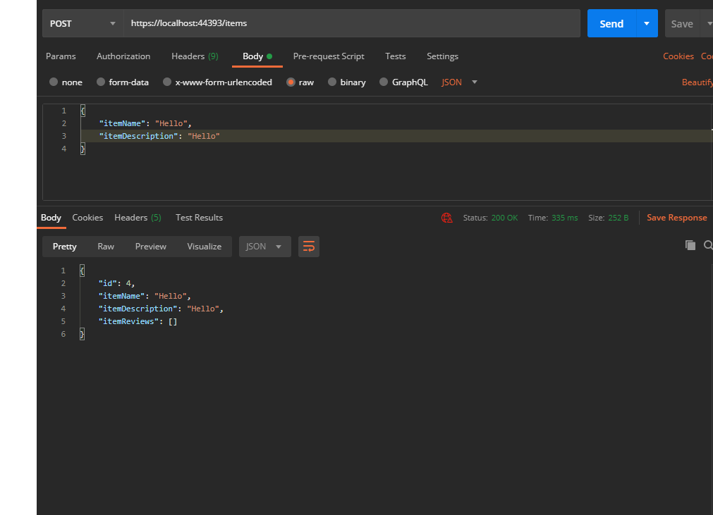

# .NET Web Api example

## **1. Requirements**

- **Visual Studio 2019** with .net core modules _and_ **.NET Core 3.1 SDK**
- **Postman**

## **2. Starting the project**

After cloning the project, follow these steps:

- **Restore NuGet packages** for the entire solution
- Open **Power Shell** and navigate to **FSCC/Database** directory
- Run the following command to generate database

```text
dotnet ef database update
```

## **3. Sending Requests**

Before Sending requests **make sure to turn off the SSL certificate verification** in postman.

All requests should be sent to https://localhost:44393. **All Post Requests** must have a json body. There are 3 available endpoints.

There are 3 available endpoints:

| Http Method | Endpoint | Description                        |
| ----------- | -------- | ---------------------------------- |
| /items      | Get      | Returns all created items          |
| /items      | Post     | Creates an item                    |
| /reviews    | Post     | Creates a review for selected item |

## **4. Example Screenshots**

&nbsp;&nbsp;&nbsp;&nbsp;

&nbsp;&nbsp;&nbsp;&nbsp;

&nbsp;&nbsp;&nbsp;&nbsp;

&nbsp;&nbsp;&nbsp;&nbsp;
